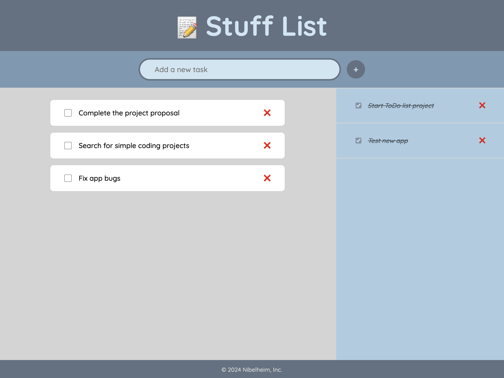

## Simple ToDo List Project

This project is a simple ToDo list coded in Vanilla Javascript, HTML and CSS.

Is one of my first projects done on my own, using the techniques I've been learning.

Features:

1. Add new tasks
2. Mark tasks as done
3. Show completed tasks on a sidebar
4. Delete a task completely.

